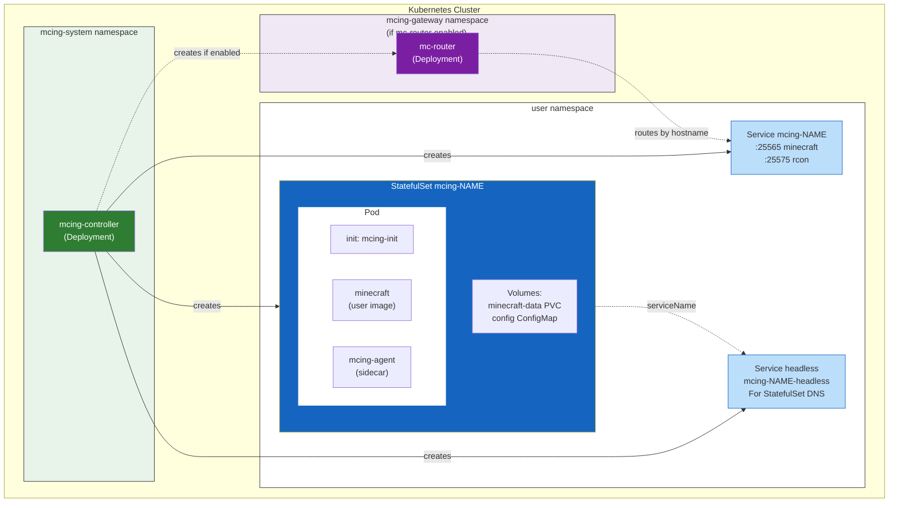
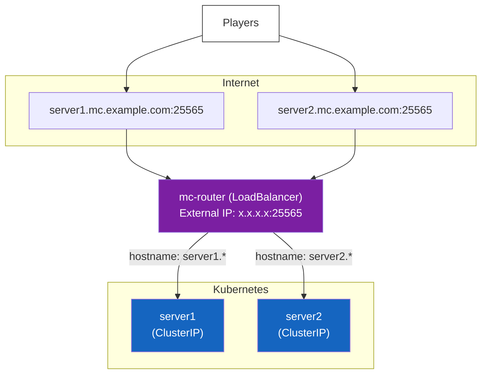

# Architecture

This document describes the architecture and components used by MCing.

## Overview

MCing is a Kubernetes operator that manages Minecraft servers. When you create a `Minecraft` custom resource, the controller creates and manages the following resources:



## Components

### MCing Controller

The main controller that watches `Minecraft` custom resources and manages the lifecycle of Minecraft servers.

| Image                              | Description                          |
| ---------------------------------- | ------------------------------------ |
| `ghcr.io/kmdkuk/mcing-controller`  | MCing controller                     |

### Pod Containers

Each Minecraft server pod contains the following containers:

| Container     | Image                           | Description                                      |
| ------------- | ------------------------------- | ------------------------------------------------ |
| `mcing-init`  | `ghcr.io/kmdkuk/mcing-init`     | Init container that prepares config files        |
| `minecraft`   | User-specified (e.g., `itzg/minecraft-server`) | The actual Minecraft server       |
| `mcing-agent` | `ghcr.io/kmdkuk/mcing-agent`    | Sidecar for RCON operations and server management |

### External Dependencies

| Image                       | Purpose                                          | Used When                |
| --------------------------- | ------------------------------------------------ | ------------------------ |
| `itzg/minecraft-server`     | Recommended Minecraft server image               | User choice              |
| `itzg/mc-router`            | Hostname-based routing proxy for Minecraft       | `--enable-mc-router`     |
| `timberio/vector` (lazymc)  | Embedded in mcing-init for auto-pause feature    | `autoPause.enabled=true` |

## Features

### Auto-Pause (lazymc)

When `autoPause.enabled` is set to `true`, MCing uses [lazymc](https://github.com/timvisee/lazymc) to automatically pause the Minecraft server when no players are connected.

**How it works:**

1. The `mcing-init` container downloads and configures lazymc
2. lazymc runs as the main process instead of the Minecraft server directly
3. lazymc starts/stops the actual Minecraft server based on player connections
4. The server pauses after `timeoutSeconds` (default: 300) of inactivity

**Configuration:**

```yaml
spec:
  autoPause:
    enabled: true
    timeoutSeconds: 300  # 5 minutes
```

### mc-router (Hostname-based Routing)

When mc-router is enabled, multiple Minecraft servers can share a single external IP address. Players connect using hostnames like `server1.minecraft.example.com`.

**How it works:**

1. mc-router is deployed in the `mcing-gateway` namespace
2. Each Minecraft service gets an annotation with its hostname
3. mc-router reads these annotations and routes connections accordingly
4. DNS wildcard points to mc-router's external IP

**Architecture with mc-router:**



### Backup Support

The `backup.excludes` field allows specifying file patterns to exclude from backups performed via `kubectl-mcing download`.

```yaml
spec:
  backup:
    excludes:
      - "*.jar"
      - "logs/*"
```

## kubectl-mcing Plugin

The `kubectl-mcing` plugin provides CLI utilities for managing Minecraft servers:

| Command    | Description                                    |
| ---------- | ---------------------------------------------- |
| `download` | Download and compress the server's data directory |

Example:

```console
kubectl mcing download minecraft-sample -o backup.tar.gz
```

## Ports

| Port  | Name       | Protocol | Description            |
| ----- | ---------- | -------- | ---------------------- |
| 25565 | minecraft  | TCP      | Minecraft server port  |
| 25575 | rcon       | TCP      | RCON management port   |
| 9080  | agent      | TCP      | mcing-agent gRPC port  |

## gRPC API (mcing-agent)

The mcing-agent sidecar exposes a gRPC API for server management:

| Method         | Description                                |
| -------------- | ------------------------------------------ |
| `Reload`       | Execute `/reload` command via RCON         |
| `SyncWhitelist`| Sync whitelist with Minecraft CR spec      |
| `SyncOps`      | Sync operators with Minecraft CR spec      |
| `SaveOff`      | Disable auto-save (for consistent backups) |
| `SaveAllFlush` | Force save all chunks                      |
| `SaveOn`       | Re-enable auto-save                        |

See [Agent RPC Reference](agentrpc.md) for detailed API documentation.
